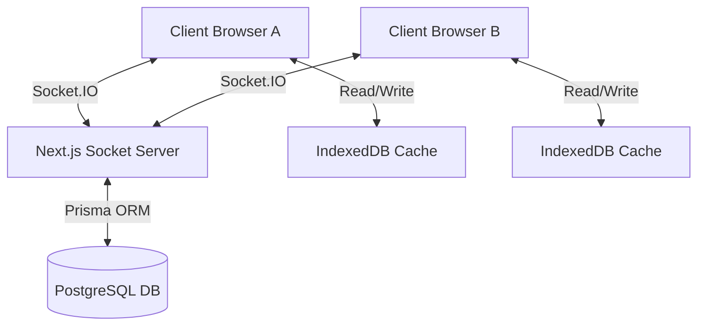

# Architecture Design Document: DocFlow Collaborative Editor

This document outlines the distributed systems architecture, offline-first data model, synchronization protocol, and security filters built into DocFlow.

---

## 🏗️ System Architecture Overview

DocFlow is built as a **Local-First, Real-time Collaborative Document Editor**. The architecture ensures high responsiveness, absolute offline capabilities, and consistent conflict resolution.

---

## 💾 Local-First & Offline Storage Engine

The client uses browser-native **IndexedDB** (wrapped in [indexeddb.ts](file:///Users/dhanush___777/Downloads/reno/lib/indexeddb.ts)) as its primary source of truth.

### Write Flow
1. **Optimistic Commit**: When a user types or updates metadata, the edit is immediately written to the local IndexedDB document cache.
2. **Operations Queueing**: A synchronization operation is pushed to the `sync_queue` table inside IndexedDB:
   - `id`: unique operation ID
   - `documentId`: document reference ID
   - `action`: `CREATE` | `UPDATE` | `DELETE`
   - `payload`: the updated fields
   - `timestamp`: epoch timestamp
3. **Immediate Render**: The UI updates instantly using local state, resulting in a zero-network-latency typing experience.

---

## 🔌 Synchronization Protocol & Socket.IO

When online, a persistent **WebSocket connection** manages communications instead of traditional REST polling.

### Event Protocol (Socket.IO)
- `join-document`: Enters the socket into a private room: `doc:${documentId}`.
- `presence:update`: Broadcasts active collaborator records (names, roles, cursors, typing status).
- `document:update`: Broadcasts edits to all online room participants.
- `document:cursor`: Broadcasts inline editing cursor offsets.
- `document:typing`: Broadcasts active block typing bubbles.
- `document:persisted`: Server confirms the database write succeeded and reports the incremented version.
- `conflict:detected`: Server detects a version gap and prompts manual reconciliation.

---

## ⚔️ Overlap-Aware Conflict Resolution & Server Merges

To prevent false-positive warning alerts (e.g., in single-user sessions or non-overlapping edits), the server handles conflict validation:

### 1. Single User Mode Bypass
Before executing conflict calculations, the server queries the active room membership size. If `roomMembers.size <= 1`, the active user is the only editor. Conflict checks are skipped, and changes are committed directly.

### 2. Metadata-Agnostic Block Checks
If multiple editors are online and a client sends a stale version checkpoint (`payload.version < serverVersion`), the server checks if their edits actually overlap:
- It fetches the common base version from `DocumentVersion`.
- It compares blocks, ignoring metadata timestamps (`updatedAt`, `updatedBy`).
- A conflict is flagged **only** if both client and server modified the **same block** to different values.

### 3. Server-Side Automatic Merging
If there is no overlapping change (e.g., Client A modified Block 1, Client B modified Block 2), the server automatically performs the 3-way merge on PostgreSQL, increments the version count, and broadcasts the merged results back to all participants, preserving collaboration flow.

---

## 🔒 Production-Grade Security & Performance

### Security Filters
- **JWT Authorization**: Sockets verify token handshakes before allowing users to join rooms.
- **Tenant Scoping**: All Prisma queries are scoped strictly by active collaboration records to prevent data leaks.
- **DDoS/OOM Safeguards**: Payloads are capped at **1MB** max size, **500 blocks** max count, and **10,000 characters** max per block. Malformed JSON blocks or prototype pollution keys (`__proto__`) are immediately blocked.

### DB Write Performance
- Updates are broadcasted to collaborators instantly.
- Saves to PostgreSQL via Prisma are **debounced by 2 seconds** per document to prevent write locks and excessive database CPU load.
